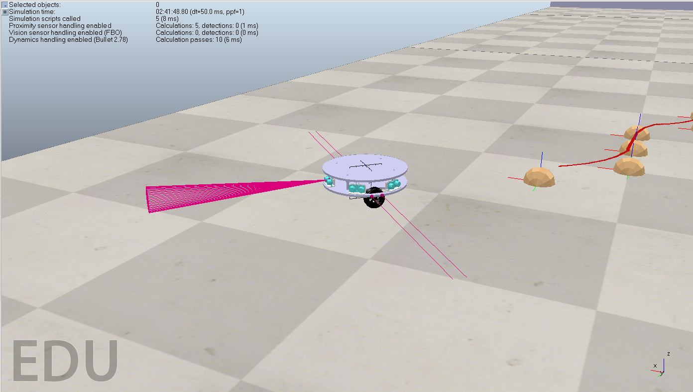
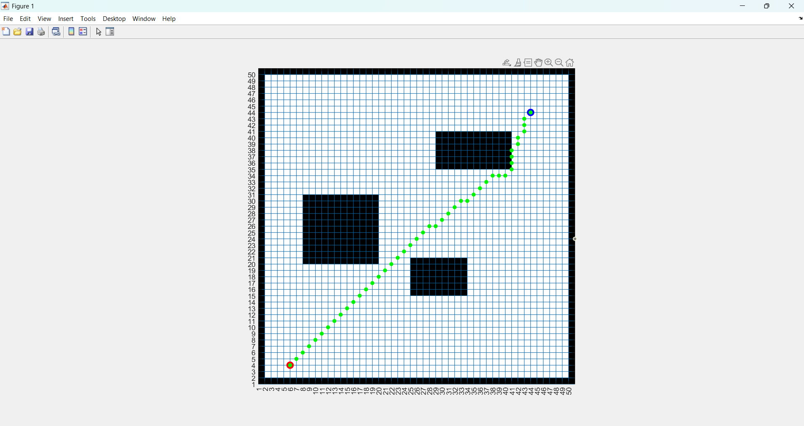
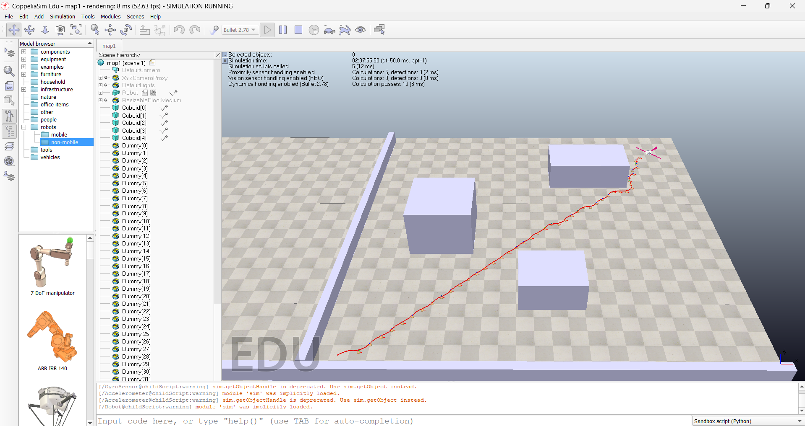

## Mathematical Explanation of A* Algorithm

A* (A-star) is an optimal pathfinding algorithm that evaluates the cost function \( f(n) \) at each node in the search space. The goal of the algorithm is to find the shortest path from the start point to the goal point on a map containing obstacles.

### A* Cost Function:

The general cost function for A* can be written as:

1. **Total Cost Function (f(n))**:
   \[
   f(n) = g(n) + h(n)
   \]
   Where:
   - \( g(n) \) is the cost to reach the current node \( n \) from the start.
   - \( h(n) \) is the heuristic estimate of the cost to reach the goal from the current node. This heuristic is often the Euclidean or Manhattan distance.

2. **Actual Cost (g(n))**:
   \[
   g(n) = g(n_{parent}) + d(n_{parent}, n)
   \]
   Where \( n_{parent} \) is the parent node of node \( n \), and \( d(n_{parent}, n) \) is the cost to move from the parent node to the current node (usually the distance between adjacent nodes).

3. **Heuristic Function (h(n))**:
   - If using **Manhattan distance** (commonly used for grid maps), the heuristic function is:
     \[
     h(n) = |x_n - x_{goal}| + |y_n - y_{goal}|
     \]
     Where \((x_n, y_n)\) is the current node's coordinates, and \((x_{goal}, y_{goal})\) is the goal node's coordinates.

4. **A* Algorithm**:
   - Maintain an open list of nodes to explore.
   - For each current node, evaluate all neighboring nodes and calculate their \( f(n) \).
   - Choose the node with the lowest \( f(n) \) value to explore next.
   - Repeat until the goal is found or no nodes remain to explore.

#### Goal of A*:
The goal of A* is to find the optimal path from the start to the goal, minimizing the cost \( f(n) \) while avoiding obstacles.

*You can add an image here of the robot’s movement on a grid map in MATLAB to visualize how A* works.*

---

## Mathematical Explanation of PID Controller

The PID (Proportional-Integral-Derivative) controller is a common control method in engineering, particularly in robotics, for automatic control. PID uses three components: proportional (P), integral (I), and derivative (D) to adjust the control signal, ensuring the system reaches and maintains the desired state (such as position or speed).

The general formula for a PID controller is:

\[
u(t) = K_p e(t) + K_i \int e(t) \, dt + K_d \frac{de(t)}{dt}
\]

Where:
- \( u(t) \) is the control signal (e.g., motor speed).
- \( e(t) = r(t) - y(t) \) is the error at time \(t\), where \(r(t)\) is the desired value and \(y(t)\) is the actual value.
- \( K_p \), \( K_i \), and \( K_d \) are the proportional, integral, and derivative gains, respectively.

### PID Components:
- **P (Proportional)**: Responds to the current error. The control signal is proportional to the size of the error. The proportional term is \( K_p e(t) \).
- **I (Integral)**: Responds to the accumulated error over time, helping eliminate steady-state error. The integral term is \( K_i \int e(t) \, dt \).
- **D (Derivative)**: Responds to the rate of change of the error, helping reduce overshoot and oscillation. The derivative term is \( K_d \frac{de(t)}{dt} \).

### PID Calculation:
When controlling the robot, PID adjusts the speed of each wheel to achieve the desired position or orientation. The control algorithm adjusts \( v_L \) (left wheel speed) and \( v_R \) (right wheel speed) so that the robot follows the calculated path from A*.

---

## Differential Drive for 2-Wheel Robot

In the control of a 2-wheel robot, the most common method is **differential drive**. In this system, the robot has two drive wheels that can rotate independently, and the robot’s direction is determined by the difference in speed between the two wheels.

1. **Robot Velocity Formulas**:
   Let \( v_L \) and \( v_R \) be the velocities of the left and right wheels, respectively.
   - The linear velocity of the robot is calculated as:
     \[
     v = \frac{v_L + v_R}{2}
     \]
   - The angular velocity (rotation rate) of the robot is calculated as:
     \[
     \omega = \frac{v_R - v_L}{d}
     \]
     Where:
     - \( v \) is the linear velocity of the robot.
     - \( \omega \) is the angular velocity of the robot.
     - \( d \) is the distance between the two wheels (robot’s width).

2. **Movement Behavior**:
   - If \( v_L = v_R \), the robot moves straight ahead.
   - If \( v_L \neq v_R \), the robot turns in a circular path.

### PID Control in Differential Drive:
When applying PID control to a differential drive robot, we adjust the speed of each wheel to reach the desired position or orientation:
- The robot adjusts \( v_L \) and \( v_R \) to follow the path generated by A*.
- PID controllers adjust the speed of each wheel to keep the robot on the desired path and maintain the correct orientation.

*Here, you can insert an image of the robot in action, showing its movement along the map with the differential drive control applied.*

---

## Images in Project

1. **Robot in Action**: Show an image of your robot, either in a real-world setup or a simulation, demonstrating how it moves along the path.

   

2. **MATLAB Pathfinding Map**: Include an image of the map used in MATLAB for pathfinding, showing the grid, obstacles, and the optimal path calculated by the A* algorithm.

   

3. **CoppeliaSim Simulation**: Display a screenshot from CoppeliaSim showing the robot following the calculated path on the map in the simulation environment.

   

---

## Setting up API for Communication

For your MATLAB code to communicate with the robot in CoppeliaSim, you'll need to set up an API for data exchange. Here's how you can do that:

1. **CoppeliaSim API Setup**:
   - Ensure that CoppeliaSim is running before starting MATLAB. The CoppeliaSim environment needs to be initialized first so that it can accept API requests from MATLAB.
   - In CoppeliaSim, enable remote API by going to **"Remote API"** settings and selecting the appropriate port for communication (usually 19997).

2. **MATLAB Setup**:
   - Install the **CoppeliaSim Remote API** for MATLAB. You can find it in the CoppeliaSim installation directory under `programming/remoteApi/matlab`.
   - Make sure that MATLAB is configured to communicate with CoppeliaSim through the API. The MATLAB script will need to load the CoppeliaSim API library using `loadlibrary`.

3. **Connecting MATLAB to CoppeliaSim**:
   - In MATLAB, use the following code snippet to connect to CoppeliaSim:
     ```matlab
     sim=remApi('remoteApi');
     clientID = sim.simxStart('127.0.0.1',19997,true,true,5000,5);
     if clientID > -1
         disp('Connected to CoppeliaSim');
     else
         disp('Failed to connect to CoppeliaSim');
     end
     ```

4. **Sending Data to and from CoppeliaSim**:
   - Once the connection is established, you can send and receive data from CoppeliaSim using `simx` commands. For example, to control the robot’s motors, use:
     ```matlab
     [res, leftMotor] = sim.simxGetObjectHandle(clientID, 'leftMotor', sim.simx_opmode_blocking);
     [res, rightMotor] = sim.simxGetObjectHandle(clientID, 'rightMotor', sim.simx_opmode_blocking);
     sim.simxSetJointTargetVelocity(clientID, leftMotor, v_L, sim.simx_opmode_oneshot);
     sim.simxSetJointTargetVelocity(clientID, rightMotor, v_R, sim.simx_opmode_oneshot);
     ```

   - Replace `v_L` and `v_R` with the velocities for the left and right wheels based on your PID control outputs.

5. **Shutting down the connection**:
   - Once the simulation is complete, make sure to close the connection properly:
     ```matlab
     sim.simxFinish(clientID);
     sim.delete();
     ```

---

### Important Note:

**CoppeliaSim must be running before executing the MATLAB code**. If the CoppeliaSim simulation is not initialized, the connection between MATLAB and CoppeliaSim will fail, and the robot will not be able to be controlled.

---

This guide provides the steps to set up the API for communication between MATLAB and CoppeliaSim, as well as instructions for sending control commands to the robot in CoppeliaSim using a PID controller for differential drive. The images of the robot, MATLAB map, and CoppeliaSim simulation will help visualize the control process.
